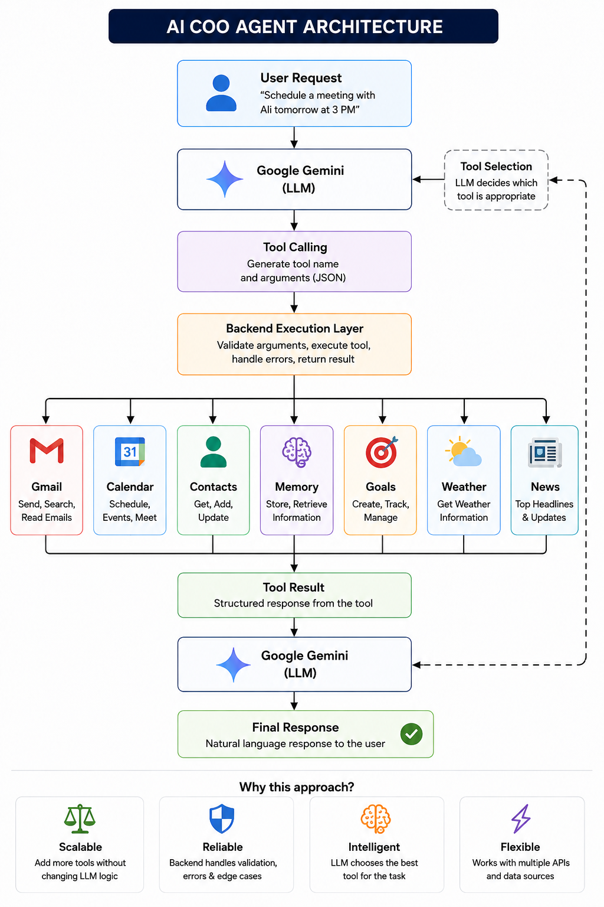

# AI-Powered Advance COO System

An AI-powered Chief Operating Officer (COO) built with **FastAPI,
Gemini, SQLModel, and tool calling**.

The system is designed to act as an intelligent personal/operational
assistant that can understand natural-language requests and use
specialized tools to perform actions such as:

-   📧 Send emails through Gmail
-   📅 Create calendar events
-   👥 Manage contacts
-   🧠 Store and retrieve memory
-   🎯 Manage goals
-   🌤️ Get weather information
-   📰 Retrieve news
-   🤖 Orchestrate tools through an AI COO/Planner agent

The core idea is to let the Gemini model decide which tool should be
used instead of building a large collection of hard-coded `if/elif`
statements.

------------------------------------------------------------------------

## Architecture


<p align="center">
  
</p>
```

------------------------------------------------------------------------

## Project Structure

The following structure reflects the current project shown in the
repository:

``` text
ai-system/
│
├── app/
│   │
│   ├── agents/
│   │   ├── __pycache__/
│   │   └── planner_agent.py
│   │
│   ├── core/
│   │   ├── __pycache__/
│   │   ├── config.py
│   │   └── gemini.py
│   │
│   ├── memory/
│   │   ├── __pycache__/
│   │   ├── db.py
│   │   ├── memory.py
│   │   └── models.py
│   │
│   ├── orchestrator/
│   │   ├── __pycache__/
│   │   └── coo.py
│   │
│   └── tools/
│       ├── __pycache__/
│       ├── base.py
│       ├── calendar.py
│       ├── executor.py
│       ├── gmail.py
│       ├── news.py
│       ├── registry.py
│       └── weather.py
│
├── .env
├── .gitignore
├── credentials.json
├── main.py
├── pyproject.toml
├── python-version
├── README.md
├── token.json
└── token_calendar.json
```

> `__pycache__` directories, virtual-environment files, and OAuth token
> files are runtime/generated files and should normally not be committed
> to a public repository.

------------------------------------------------------------------------

# Components

## 1. FastAPI Application

`main.py` is the application entry point.

FastAPI provides the HTTP API through which a client can communicate
with the COO system.

Typical flow:

``` text
HTTP Request
     |
     v
FastAPI
     |
     v
COO Agent
     |
     v
Gemini
     |
     v
Tool
     |
     v
Tool Result
     |
     v
Final Response
```

------------------------------------------------------------------------

## 2. COO Orchestrator

Location:

``` text
app/orchestrator/coo.py
```

The COO orchestrator is responsible for coordinating the AI system.

It acts as the central layer between the user's request, Gemini, the
planner, and the available tools.

The goal is to make the system capable of handling requests such as:

``` text
"Send an email to Ali."

"What's the weather in Lahore?"

"Give me the latest technology news."

"Schedule a meeting tomorrow at 10 AM."

"Remember that Ahmed's email is ahmed@example.com."
```

------------------------------------------------------------------------

## 3. Planner Agent

Location:

``` text
app/agents/planner_agent.py
```

The planner/agent layer is responsible for helping the COO determine
what needs to happen for a user request.

With Gemini tool calling, the model can select an appropriate registered
tool and provide the arguments required by that tool.

For example:

``` text
User:
What's the weather in Karachi?

Gemini
   |
   +--> weather tool
             |
             +--> city = Karachi
```

------------------------------------------------------------------------

# Tools

All external capabilities are organized under:

``` text
app/tools/
```

## Base Tool

``` text
app/tools/base.py
```

The base tool provides the common interface used by the system's tools.

A common pattern is:

``` python
class BaseTool:
    def name(self):
        ...

    def run(self, input: dict):
        ...
```

This gives the application a consistent way to register and execute
different tools.

------------------------------------------------------------------------

## Gmail Tool

``` text
app/tools/gmail.py
```

The Gmail tool integrates with the Gmail API.

It uses Google's OAuth 2.0 flow and the Gmail API to authenticate and
send emails.

The current implementation uses:

``` text
https://www.googleapis.com/auth/gmail.send
```

The first authentication creates an OAuth token that can be reused on
subsequent executions.

Typical flow:

``` text
COO Agent
    |
    v
Gmail Tool
    |
    v
Google OAuth
    |
    v
Gmail API
    |
    v
Email Sent
```

Example request:

``` text
"Send an email to Ali saying the meeting has been moved to tomorrow."
```

------------------------------------------------------------------------

## Calendar Tool

``` text
app/tools/calendar.py
```

The calendar tool provides calendar-related functionality through
Google's Calendar API.

OAuth credentials are stored locally after authentication so the user
does not need to authenticate on every execution.

Example request:

``` text
"Schedule a meeting tomorrow at 10 AM."
```

The agent can identify the calendar tool and pass the required event
information.

------------------------------------------------------------------------

## Weather Tool

``` text
app/tools/weather.py
```

The weather tool retrieves weather information from a weather API.

Example:

``` text
"What's the weather in Islamabad?"
```

The AI can select the weather tool and provide:

``` json
{
  "city": "Islamabad"
}
```

------------------------------------------------------------------------

## News Tool

``` text
app/tools/news.py
```

The news tool retrieves current news based on the requested
topic/category.

Example:

``` text
"Give me the latest AI and technology news."
```

The agent can select the news tool and retrieve the relevant
information.

------------------------------------------------------------------------

## Tool Registry

``` text
app/tools/registry.py
```

The registry provides a central place for the available tools.

Conceptually:

``` text
Tool Registry
     |
     +-- Gmail
     +-- Calendar
     +-- Weather
     +-- News
     +-- Other Tools
```

This makes it easier to add new capabilities without changing the core
COO logic.

To add another capability in the future, a new tool can be implemented
and registered with the system.

------------------------------------------------------------------------

## Tool Executor

``` text
app/tools/executor.py
```

The executor is responsible for taking a tool selected by the AI and
executing the corresponding Python implementation.

Conceptually:

``` text
Gemini
  |
  | function/tool call
  v
Executor
  |
  v
Registered Tool
  |
  v
Tool Result
```

This separates **decision making** from **tool execution**.

------------------------------------------------------------------------

# Memory System

The memory layer is located at:

``` text
app/memory/
```

It currently contains:

``` text
db.py
memory.py
models.py
```

## SQLModel Models

The current models include:

### Contact

``` python
class Contact(SQLModel, table=True):
    id: Optional[int] = Field(default=None, primary_key=True)
    name: str
    email: str
```

Contacts can be stored and retrieved as persistent data.

------------------------------------------------------------------------

### Memory

``` python
class Memory(SQLModel, table=True):
    id: Optional[int] = Field(default=None, primary_key=True)
    type: str
    content: str
```

This provides a foundation for long-term memory.

Examples of information that could be stored:

``` text
User preferences
Important conversations
Previous actions
Important facts
Notes
```

------------------------------------------------------------------------

### Goal

``` python
class Goal(SQLModel, table=True):
    id: Optional[int] = Field(default=None, primary_key=True)
    goal: str
    status: str = "active"
```

The goal model allows the COO to keep track of user objectives.

Example:

``` text
Goal:
Learn AI Agent Development

Status:
active
```

------------------------------------------------------------------------

# Gemini Integration

The Gemini configuration is located in:

``` text
app/core/gemini.py
```

Configuration values are managed through:

``` text
app/core/config.py
```

The Gemini model acts as the reasoning and tool-selection layer.

The basic architecture is:

``` text
User Request
      |
      v
    Gemini
      |
      +------> Tool Call
      |
      +------> Final Answer
```

The important distinction is that the application does not need to
determine every intent using hard-coded routing.

Instead, Gemini can select from the tools made available to it.

------------------------------------------------------------------------

# Example Tool-Calling Flow

### Weather

``` text
User:
What's the weather in Karachi?

        |
        v

Gemini
        |
        v

weather_tool(city="Karachi")

        |
        v

Weather API

        |
        v

Weather Result

        |
        v

Gemini

        |
        v

Final Response
```

------------------------------------------------------------------------

### News

``` text
User:
Give me the latest AI news.

        |
        v

Gemini
        |
        v

news_tool(category="technology")
        |
        v
News API
        |
        v
Results
        |
        v
Gemini
        |
        v
Final Response
```

------------------------------------------------------------------------

### Gmail

``` text
User
 |
 v
Gemini
 |
 v
gmail_tool
 |
 v
Google OAuth
 |
 v
Gmail API
 |
 v
Email Sent
```

------------------------------------------------------------------------

### Calendar

``` text
User
 |
 v
Gemini
 |
 v
calendar_tool
 |
 v
Google Calendar API
 |
 v
Event Created
```

------------------------------------------------------------------------

# Multi-Tool Workflows

The system can be extended to execute multiple tools for a single user
request.

For example:

``` text
User:

Find Ali's email and send him an email
about tomorrow's meeting.
```

Possible execution:

``` text
                 Gemini
                    |
                    v
              get_contact()
                    |
                    v
              Contact Result
                    |
                    v
              send_email()
                    |
                    v
                Gmail API
                    |
                    v
              Final Response
```

This is one of the key characteristics of an AI agent: the model can
determine the sequence of actions required to complete a task.

------------------------------------------------------------------------

# Environment Variables

Create a `.env` file and store secrets there.

Example:

``` env
GEMINI_API_KEY=your_gemini_api_key
WEATHER_API_KEY=your_weather_api_key
NEWS_API_KEY=your_news_api_key
```

Use the variables required by the tools implemented in your project.

## Important

Do not commit secrets to GitHub.

Your `.gitignore` should include sensitive/runtime files such as:

``` text
.env
token.json
token_calendar.json
credentials.json
.venv/
__pycache__/
```

OAuth credential files and tokens should be treated as secrets.

If `credentials.json` contains OAuth client credentials, keep it out of
a public repository.

------------------------------------------------------------------------

# Installation

## 1. Clone the repository

``` bash
git clone <YOUR_REPOSITORY_URL>
cd ai-system
```

## 2. Create a virtual environment

### Windows

``` bash
python -m venv .venv
.venv\Scripts\activate
```

### Linux/macOS

``` bash
python3 -m venv .venv
source .venv/bin/activate
```

## 3. Install dependencies

If using `pyproject.toml`:

``` bash
pip install -e .
```

Or install the project's required packages according to the dependency
configuration.

------------------------------------------------------------------------

# Google OAuth Setup

The Gmail and Calendar tools use Google OAuth.

You need to create OAuth credentials in Google Cloud and enable the
required APIs.

For Gmail, the current application uses:

``` text
https://www.googleapis.com/auth/gmail.send
```

For Calendar, enable the Google Calendar API and configure the required
OAuth scope used by the calendar tool.

Place the OAuth client configuration in the expected location:

``` text
credentials.json
```

On first authentication, Google will open the OAuth consent flow.

After successful authentication, token files are generated locally.

``` text
token.json
token_calendar.json
```

Do not commit these token files to source control.

------------------------------------------------------------------------

# Running the Application

Start the FastAPI application:

``` bash
uvicorn main:app --reload
```

The API should then be available at:

``` text
http://127.0.0.1:8000
```

FastAPI Swagger UI:

``` text
http://127.0.0.1:8000/docs
```

------------------------------------------------------------------------

# Example Requests

The exact endpoint depends on the current implementation in `main.py`.

Conceptual examples include:

``` text
Add a task to learn LangGraph.
```

``` text
Remember that Ali's email is ali@gmail.com.
```

``` text
What's the weather in Lahore?
```

``` text
Give me the latest technology news.
```

``` text
Send an email to Ahmed about tomorrow's meeting.
```

``` text
Schedule a meeting for tomorrow at 10 AM.
```

------------------------------------------------------------------------

# Design Principles

The project follows several important AI-agent design principles.

### 1. LLM as the decision layer

Gemini determines which capability is required.

### 2. Tools as deterministic execution layers

The actual API calls and business operations are performed by Python
tools.

### 3. Registry-based architecture

Tools are registered centrally so that new capabilities can be added
without rewriting the entire agent.

### 4. Persistent memory

Important information can be stored using SQLModel-backed database
models.

### 5. Separation of concerns

``` text
FastAPI
   |
   +-- API Layer

COO
   |
   +-- Orchestration

Planner
   |
   +-- Agent Planning

Gemini
   |
   +-- Reasoning / Tool Selection

Tools
   |
   +-- External Actions

Memory
   |
   +-- Persistent State
```

------------------------------------------------------------------------

# Roadmap

The system can continue evolving into a production-grade autonomous COO.

## Current

-   [x] FastAPI backend
-   [x] Gemini integration
-   [x] COO orchestration
-   [x] Planner agent
-   [x] Tool registry
-   [x] Tool executor
-   [x] Gmail tool
-   [x] Calendar tool
-   [x] Weather tool
-   [x] News tool
-   [x] SQLModel memory models
-   [x] Contact model
-   [x] Goal model
-   [x] Memory model

## Future Improvements

The current system is functional, but the following improvements are planned for future iterations:

- Persistent conversation memory
- Redis-based caching
- Authentication and authorization
- Structured logging and observability
- Background task processing
- Docker containerization
- Kubernetes deployment
- Production monitoring

------------------------------------------------------------------------

# Production Architecture

The long-term architecture can evolve toward:

``` text
                         ┌───────────────┐
                         │     User      │
                         └───────┬───────┘
                                 |
                                 v
                         ┌───────────────┐
                         │    FastAPI    │
                         └───────┬───────┘
                                 |
                                 v
                       ┌───────────────────┐
                       │    COO Agent      │
                       │      Gemini       │
                       └─────────┬─────────┘
                                 |
                    ┌────────────┼────────────┐
                    |            |            |
                    v            v            v
                 Planner       Memory       Tools
                    |            |            |
          ┌─────────┼──────┐     |      ┌─────┼──────────┐
          |         |      |     |      |     |          |
          v         v      v     v      v     v          v
        Gmail    Calendar News  DB   Weather Tasks    Contacts
                                 |
                           ┌─────┴─────┐
                           | PostgreSQL |
                           |   Redis    |
                           |   Qdrant   |
                           └───────────┘
```

------------------------------------------------------------------------

# Security

Because this system can perform real-world actions, security is
especially important.

Before production deployment:

-   Protect FastAPI endpoints with authentication.
-   Never expose API keys.
-   Never commit OAuth tokens.
-   Validate all tool arguments.
-   Restrict dangerous tool operations.
-   Add confirmation before sensitive actions such as sending emails.
-   Add rate limiting.
-   Log tool execution.
-   Implement authorization for user-specific data.
-   Use HTTPS.
-   Protect database credentials.
-   Keep OAuth scopes as narrow as possible.

A useful production pattern is:

``` text
User Request
     |
     v
Gemini
     |
     v
Sensitive Action?
     |
    Yes
     |
     v
Human Confirmation
     |
     v
Execute Tool
```

------------------------------------------------------------------------

# Why This Project?

This project demonstrates how modern AI applications combine:

``` text
LLMs
+
Tool Calling
+
APIs
+
Memory
+
Orchestration
+
Backend Engineering
```

The goal is not simply to build a chatbot.

The goal is to build an AI system that can:

1.  Understand a user's request.
2.  Determine what action is required.
3.  Select the appropriate tool.
4.  Execute the action.
5.  Use the result.
6.  Continue with another tool when necessary.
7.  Maintain useful memory.
8.  Return a final response to the user.

------------------------------------------------------------------------

# Author

**Shazil Ali**

AI Engineer \| Python \| FastAPI \| AI Agents \| AWS \| Kubernetes

------------------------------------------------------------------------

## License

This project is intended for learning and development purposes.

Add your preferred license here before publishing the repository
publicly.
